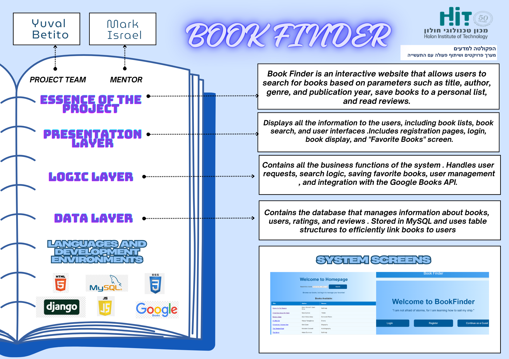
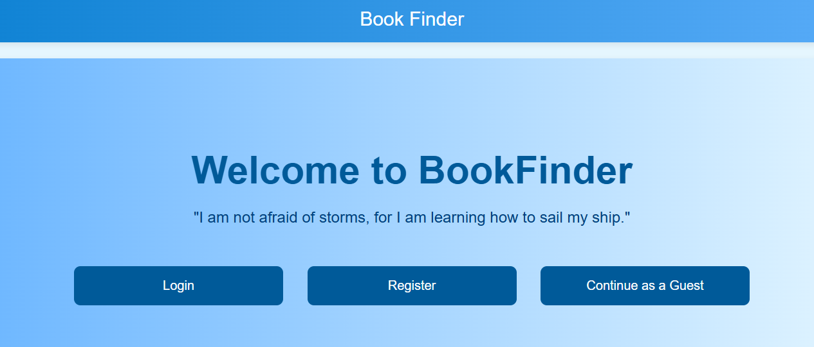
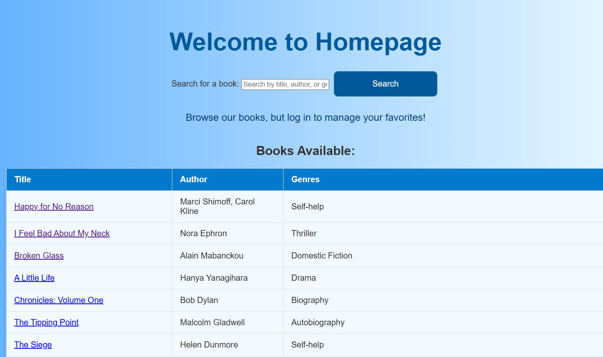

# 📚 BookFinder Project



## 📝 Overview
Many readers struggle to find books suited to their tastes due to scattered information sources like online stores, libraries, and personal recommendations. **BookFinder** is an interactive web platform designed to centralize this information and streamline the book discovery process.

---

## 🎯 Project Purpose
BookFinder aims to simplify and enhance users’ book-search experience by:
- Allowing users to search books by title, author, genre, or year.
- Providing detailed book information, summaries, ratings, and reviews.
- Offering a personal reading list feature and sharing recommendations.
- Facilitating administrators in managing data and tracking user activity.

---

## 📖 System Description

### 🌐 Web Application
- Built using **Django** framework.
- Integrates external APIs (Google Books).
- Supports manual book entry by users/admins.

### 💾 Database
- **MySQL** for managing user, book, and review data.
- Optimized for quick search and data linking.

---

## 👥 User Types
| User Type     | Capabilities                                                   |
|---------------|----------------------------------------------------------------|
| **Regular**   | Search, view details, rate books, add reviews, save favorites. |
| **Manager**   | Add/edit/delete books, manage users, track reports.            |
| **Bot**       | Collects and organizes external data automatically.            |

---

## 🚀 Main Features

- 🔍 **Advanced Search**: Quickly search by multiple criteria.
- 📝 **Registration & Login**: Full user authentication.
- 📚 **Personalized Bookshelf**: Save and manage favorite books.
- 📊 **Reviews & Ratings**: Share your opinion on books.
- 📂 **Admin Dashboard**: Full control over content and user activity.

---

## 📸 System Screenshots

| Welcome Page | Login Page |
|--------------|------------|
|  |  |

| User Homepage | Book Details |
|---------------|--------------|
|  |  |

(*החליפי את התמונות בהתאם לאלו שיש לך*)

---

## ⚙️ Database Structure

| Table            | Description                                          |
|------------------|------------------------------------------------------|
| **Books**        | Details about books, including cover images.         |
| **Users**        | User details, authentication, and favorites.         |
| **Genres**       | Genre categorization of books.                       |
| **Reviews**      | User-generated ratings and reviews.                  |
| **FavoriteBooks**| Links users to their favorite books.                 |

---

## 🛠️ Technologies Used


---

## 🚦 Installation and Usage

```bash
git clone https://github.com/Yuval-Betito/book.git
cd book
pip install -r requirements.txt
python manage.py migrate
python manage.py runserver
